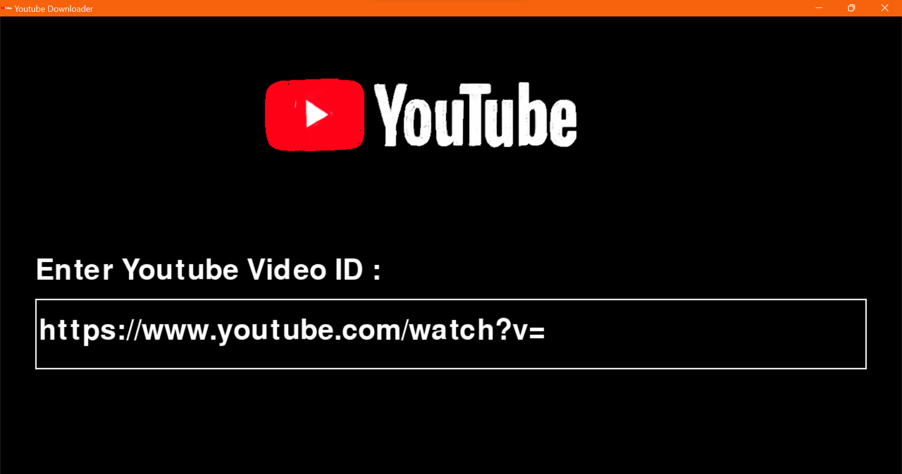
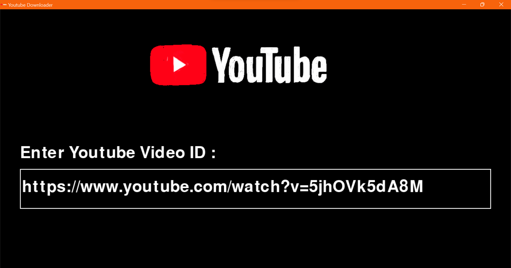

  <br/>
Youtube Downloader made with Python, pygame framework and pytube library


 
<br/>

# Screens






<br/>


# Installation

```GNU/Linux ```
```
git clone https://github.com/daviiid99/Youtube_Downloader.git Youtube_Downloader
cd Youtube_Downloader
python3 main.py
```
<br/>

``` Microsoft Windows```
```
git clone https://github.com/daviiid99/Youtube_Downloader.git Youtube_Downloader
cd Youtube_Downloader
python main.py
```
